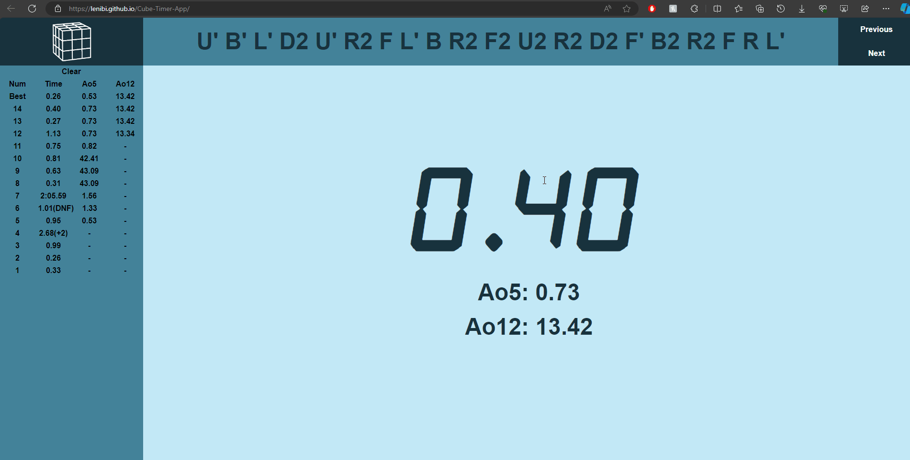

# Cube Timer Web App
<a href="https://lenibi.github.io/Cube-Timer-App/">Click Here To Use App</a>
Works best on a PC screen. Design is responsive, works on mobile but not as well.

Original repo: https://github.com/imd1005-web-development-winter-2023/assignment-03-Lenibi

## Description

A timer app that keeps track of times and automatically calculates your averages. Features such as clear function, next or previous scramble, saving your scrambles, and editing times with +2 or DNF (did not finish). Made for speedcubers (solving Rubik's Cubes fast) to help them with their solves. Scrambles are just randomly generated, does not follow proper WCA scramble standards.
**This is an old project.** Code is very messy and long as I was not as experienced. There are bugs in the average and best times calculations, but works most of the time.

## How to use

* Hold the space bar, then release to start the time once the font is green. There is a hold delay for accidental spacebar presses in red font.
* Once the timer is running, tap the space to stop the timer.
* View your averages on the left side. The table becomes scrollable once you run out of space on the screen.
* Click on the individual times for editing options.
* +2 adds 2 seconds to the time. DNF or Did Not Finish sets it as an invalid solve and counts it as 0.
* 
